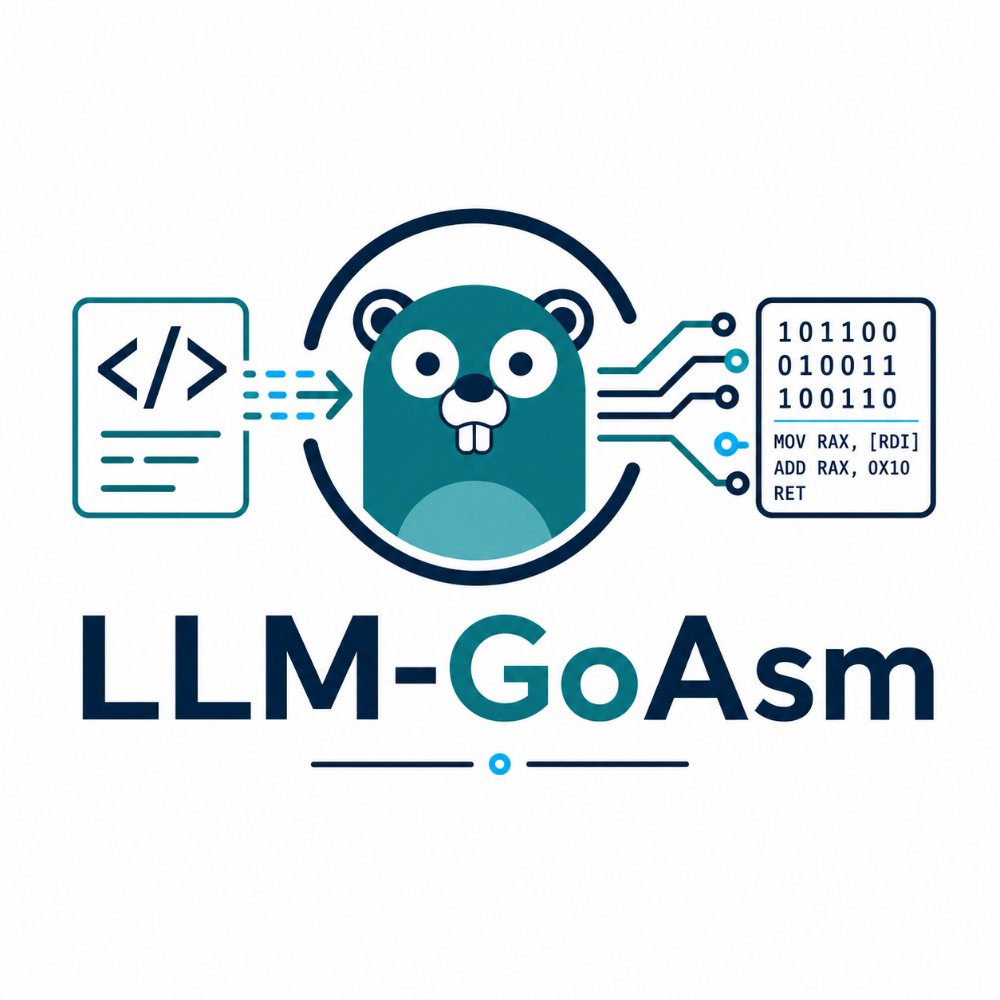
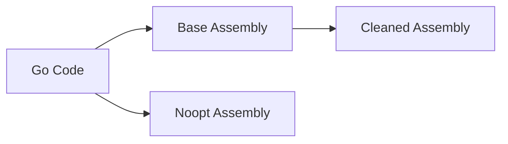

# LLM GoAsm Dataset

A dataset for evaluating how well can the LLM authorship of compiled go code be identified.

<div style="text-align: center;">
    
</div>

## Abstract

While recent work has demonstrated that Large Language Models (LLMs) leave distinguishable stylistic fingerprints in generated source code, a critical question remains unexplored: do these authorship signals survive the compilation process to binary, and can they be reliably recovered from decompiled assembly? This paper presents the first systematic study of LLM authorship attribution for compiled Go binaries. We introduce **LLM-GoAsm**, a dataset of 5,000 compilable Go programs generated by 5 state-of-the-art LLMs across 1,000 diverse tasks, with each program represented in four complementary forms: canonical source code, source-linked assembly, simplified source-linked assembly, and non-optimized simplified assembly. This multi-representation design enables systematic investigation of how authorship signals degrade through the compilation pipeline. Using this dataset, we benchmark traditional machine learning classifiers (XGBoost, Random Forest, Linear SVM, Logistic Regression, KNN) and fine-tuned transformer models (BERT, CodeBERT, Longformer, ModernBERT, CodeT5-Authorship, Qwen3-4B), employing both sliding-window and long-context processing strategies. On source code, the best model (ModernBERT) achieves 90.76% accuracy on 5-class evaluation, with CodeBERT reaching 81.83%. On assembly representations, accuracy ranges from 50-60% for the strongest models, demonstrating that LLM authorship fingerprints, while substantially attenuated, remain detectable well above random baseline (20%). Our results indicate that stylometric signals partially survive compilation, with source-linked assembly preserving more signal than simplified variants. To support open science and reproducibility, we release the **LLM-GoAsm** dataset, all training scripts, model checkpoints, and analysis code on GitHub: https://github.com/LLM-GoAsm-Dataset.

## Usage

The full dataset is available as a single JSON list (`.jsonl`) file `dataset/llm-goasm-dataset.jsonl`, where each line is a self-contained JSON document. This helps with not having to read the full ~500 MB into memory at once.

Python processing recommendation:

```py
with open(datasets/llm-goasm-dataset.jsonl, 'r') as f:
    for line in f:
        properties = json.loads(line)
        # ...
        print(properties['model'])
```

This code processes one line at a time, only storing the current line in memory.

### Structure

Each entry contains some metadata, such as IDs, prompt information and model information as well as the resulting code and assemblies.

|Parameter|Type|Description|
|-|-|-|
|`id`|`int`|A unique identifier for each record, starting at 1|
|`prompt_id`|`int`|The identifier for each question. The same for each model on the same question|
|`category`|`str`|The main category of the question. One of: `functions`, `cli`, `plugins`, `servers`|
|`modifiers`|`str`|A modifier to generate alternate solutions to a question. One of: `default`, `parallel`, `optimized`, `error`|
|`preprompt`|`str`|Base instructions based on the `category` and `modifier` combination|
|`prompt`|`str`|The text of the task. Same content for each `prompt_id`|
|`model`|`str`|Name of the models that generated the code. Details in next table|
|`go-code-data`|`str`|The compilable Go code generated with the current prompt by the model|
|`go-code-length`|`int`|Byte length of `go-code-data`|
|`go-code-lines`|`int`|Number of line of `go-code-data`|
|`go-code-tokens`|`int`|Number of tokens of `go-code-data` using `cl100k_base` tokenizer|
|`asm-base-data`|`str`|The built Go code disassembed into assembly an filtered for the user-generated section|
|`asm-base-length`|`int`|Byte length of `asm-base-data`|
|`asm-base-lines`|`int`|Number of line of `asm-base-data`|
|`asm-base-tokens`|`int`|Number of tokens of `asm-base-data` using `cl100k_base` tokenizer|
|`asm-clean-data`|`str`|The content of `asm-base-data` that went through another round of cleanup to reduce irrelevant token size.|
|`asm-clean-length`|`int`|Byte length of `asm-clean-data`|
|`asm-clean-lines`|`int`|Number of line of `asm-clean-data`|
|`asm-clean-tokens`|`int`|Number of tokens of `asm-clean-data` using `cl100k_base` tokenizer|
|`asm-noopt-data`|`str`|Same process as `asm-clean-data` but the code optimization feature is turned off in the compiler.|
|`asm-noopt-length`|`int`|Byte length of `asm-noopt-data`|
|`asm-noopt-lines`|`int`|Number of line of `asm-noopt-data`|
|`asm-noopt-tokens`|`int`|Number of tokens of `asm-noopt-data` using `cl100k_base` tokenizer|

### Models

The dataset contains the following 8 models. Each were ran using: https://openrouter.ai

- `meta-llama_llama-4-scout` - Llama 4 Scout
- `qwen_qwen3-coder` - Qwen 3 Coder
- `deepseek_deepseek-v3__2-exp` - Deepseek v3.2 Experimental
- `gpt-oss-120b` - GPT-OSS
- `openai_gpt-5-mini` - GPT 5 Mini
- `x-ai_grok-code-fast-1` - Grok Code Fast
- `microsoft_phi-4` Microsoft Phi 4

Each models completed 1000 tasks in total, so the dataset has 8,000 entries.

### Process

Creation of: **Go Code** (`go-code-data`)

- The Go code was generated with the LLMs and compiled in a harness ([generate.ipynb](generate.ipynb)) until the code was runnable.
- The code was fixed for very basic mistakes such as formatting issues and the import of unused libraries. Since Go is a heavily opinionated language it would not compile otherwise.

Creation of: **Base Assembly** (`asm-base-data`)

- The Go code is generated in the first step into `go-code-data`
- The code is then compiled with the Go compiler
- The compiled binary is disassembled using `objdump`
- The relevant sections of the code are selected and filtered. This means that only the code written by the model remains and all other fillers of the binary are removed.

Creation of: **Cleaned Assembly** (`asm-clean-data`)

- The `asm-base-data` is generated
- Unnecessary information is removed to compact the assembly. E.g: long hex data, memory addresses, filenames and other content that is not relevant to the stylometry. This data is usually generated on compile and may differ between compilations.

Creation of: **Noopt Assembly** (`asm-noopt-data`)

- The Go code is generated in the first step into `go-code-data`
- The code is then compiled with the Go compiler, but with the automatically enabled optimizations disabled using the flag `-gcflags="-N -l"`. It disables optimizations and inlining.
- The following filtering and cleanup steps are performed the same as `asm-clean-data`




## Results

For the results please read the paper at: **FINAL ADDED AFTER PUBLICATION**
